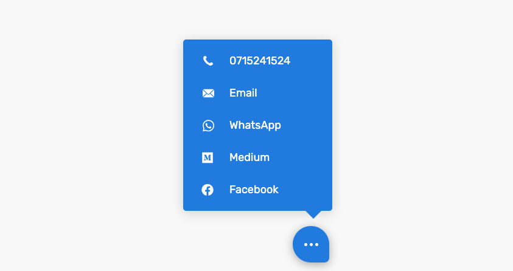

# Floating Contacts

Floating Contacts is a lightweight WordPress plugin that adds a customizable floating contact button to your website, allowing visitors to easily reach you through various communication channels.

## Features

- Customizable floating contact button
- Support for multiple contact methods: Live Chat, Phone, Email, and WhatsApp
- Responsive design for both desktop and mobile devices
- Easy configuration through the WordPress admin panel
- Font Awesome icon integration for visual appeal

## Installation

1. Upload the `floating-contacts` folder to the `/wp-content/plugins/` directory
2. Activate the plugin through the 'Plugins' menu in WordPress
3. Go to Settings > Floating Contacts to configure the plugin

## Usage

1. After activation, navigate to Settings > Floating Contacts in your WordPress admin panel.
2. Configure the contact methods you want to display:
   - Set the background color for the floating button
   - Enter your Live Chat URL (if applicable)
   - Enter your phone number
   - Enter your email address
   - Enter your WhatsApp number
3. Customize the icon for each contact method using Font Awesome class names
4. Click "Save Changes" to apply your settings

The floating contact button will now appear on your website.

## Customization

The plugin uses CSS variables for easy customization. The admin interface allows you to:

- Change the background color of the floating button
- Select icons for each contact method
- Enter custom Font Awesome icon classes

For further customization, you can add custom CSS to your theme or use a custom CSS plugin.

## Frequently Asked Questions

### How do I change the icons for the contact methods?

You can change the icons by entering Font Awesome class names in the respective fields in the plugin settings. A link to the Font Awesome icon list is provided in the admin interface for easy reference.

### Is the plugin responsive?

Yes, the Floating Contacts widget is designed to work well on both desktop and mobile devices.

### Can I add custom contact methods?

Yes, the plugin supports custom contact methods. In addition to the built-in options (Live Chat, Phone, Email, and WhatsApp), you can add your own custom contact methods through the plugin settings.

## Support

If you encounter any issues or have questions, please open an issue on the plugin's GitHub repository or contact the plugin author.

## Contributing

Contributions are welcome! Please feel free to submit a Pull Request.

## License

This plugin is licensed under the GPL v2 or later.

